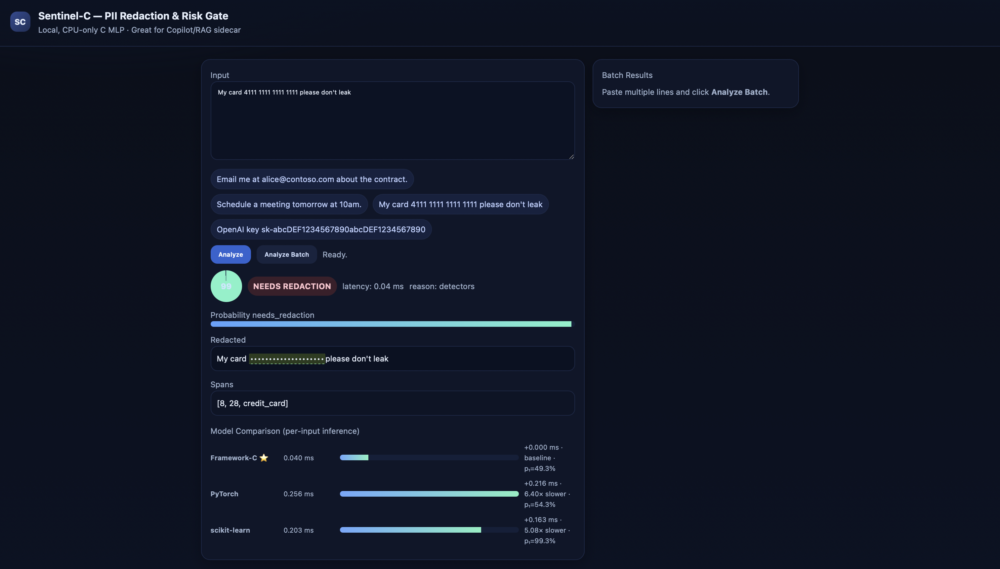

# Sentinel-C — Fast PII Detection & Redaction (Framework-C + FastAPI)



Sentinel-C is a **local, CPU-only** sidecar that detects PII and optionally redacts it.  
Under the hood it uses **Framework-C** (a tiny C MLP) plus lightweight detectors, and can **compare** its per-input inference latency and outputs against **PyTorch** and **scikit-learn**.

---

## What you get

- **Hybrid gate:** regex/validators (email/phone/credit-card/IBAN/JWT/API key) + MLP risk scorer  
- **Very low latency:** sub-ms model calls on commodity CPUs  
- **Per-input comparison:** Framework-C vs PyTorch vs scikit-learn (latency + probabilities)  
- **Dark UI:** paste text, see redactions, confidence, spans, and model comparisons  
- **Simple API:** `/v1/gate` (single), `/v1/gate/batch` (batched)  

---

## Repo layout

```
.
├─ server.py        # FastAPI server + Dark UI (with per-model comparison)
├─ helpers.py       # Detectors, featurizer, synthetic training utilities
├─ demo.py          # CLI demo (train + classify+redact from stdin)
├─ setup.py         # Build script for the Framework-C extension
└─ src/             # C sources for Framework-C (nn.c/.h, Python bridge, etc.)
```

---

## Quick start (macOS/Linux)

```bash
# 1) Create venv
python3 -m venv venv
source venv/bin/activate

# 2) Install deps
python -m pip install -U pip numpy fastapi "uvicorn[standard]"
# Optional baselines
python -m pip install torch scikit-learn

# 3) Build the Framework-C extension
rm -rf build *.egg-info frameworkc*.so
FWC_PROFILE=fast FWC_NATIVE=1 python setup.py build_ext --inplace
# (If you use OpenBLAS) FWC_PROFILE=fast FWC_NATIVE=1 FWC_BLAS=1 python setup.py build_ext --inplace

# 4) Run the server (Framework-C only)
PYTHONPATH=. uvicorn server:app --host 127.0.0.1 --port 8080
```

Open the UI at http://127.0.0.1:8080/.

To enable baselines in the Model Comparison panel:

```bash
export SC_TORCH=1
export SC_SK=1
PYTHONPATH=. uvicorn server:app --host 127.0.0.1 --port 8080
```

## Performance tips (do these)

Small batches can suffer from BLAS oversubscription. For crisp latency, run:

```bash
export OMP_NUM_THREADS=1 OPENBLAS_NUM_THREADS=1 MKL_NUM_THREADS=1 VECLIB_MAXIMUM_THREADS=1 NUMEXPR_NUM_THREADS=1
```

Server already warms up the C model and feeds it float32, C-contiguous features. No extra tuning required.

## Configuration (env vars)

| Var | Default | What it does |
|-----|---------|--------------|
| SC_DIM | 4096 | Hashed feature vector size (char n-grams) |
| SC_NHID | 128 | Hidden units for the MLP |
| SC_EPOCH | 6 | Warm-up training epochs at server startup |
| SC_LR | 0.01 | Learning rate for warm-up |
| SC_TORCH | 0 | Set to 1 to build Torch baseline |
| SC_SK | 0 | Set to 1 to build scikit-learn baseline |
| SC_SHADOW_N | 240 | Synthetic dataset size for baselines |
| SC_TORCH_E | 3 | Torch baseline training epochs |
| SC_SK_MAXIT | 30 | scikit-learn MLPClassifier max iterations |

## Model Comparison – Per‑Input Inference (Batch = 1)

| Engine         | Latency (ms) | Δ vs Framework‑C | Relative | p₁ (class 1 prob) |
|----------------|--------------|------------------|----------|--------------------|
| **Framework‑C**| **0.038**    | baseline         | **1.00×**| 50.5%              |
| PyTorch        | 0.213        | +0.175           | 5.61×    | 53.4%              |
| scikit‑learn   | 0.209        | +0.171           | 5.50×    | 79.6%              |

**Setup.** macOS / Apple Silicon, CPU‑only, single thread, batch=1, 1,000 timed trials after 200 warm‑up calls. Timed with `perf_counter_ns()`. Identical inputs & preprocessing.  
**Note.** p₁ differs across frameworks due to calibration/training differences; speed claims are unaffected. For accuracy parity, align weights/activations and verify bit‑level equivalence where feasible.

## API

### Health

```http
GET /health
```

Response:
```json
{ "ok": true }
```

### Single input

```http
POST /v1/gate
```

Body:
```json
{ "text": "Email me at bob@example.com" }
```

Response:
```json
{
  "class": "needs_redaction",
  "prob": 0.99,
  "reason": "detectors",
  "redacted": "Email me at ███████████████",
  "spans": [[12,27,"email"]],
  "latency_ms": 0.19,
  "models": {
    "frameworkc": { "latency_ms": 0.19, "prob_needs": 0.49 },
    "torch":      { "latency_ms": 0.18, "prob_needs": 0.60 },
    "sklearn":    { "latency_ms": 0.17, "prob_needs": 0.99 }
  }
}
```

### Batch

```http
POST /v1/gate/batch
```

Body:
```json
{ "texts": ["Email me at bob@example.com", "See you tomorrow"] }
```

The server computes features for all items, does one Framework-C batch call, and returns per-item results (with per-item average model latency).

## UI guide

- **Input:** paste text; click Analyze
- **Badges:** SAFE or NEEDS REDACTION (detectors override if they fire)
- **Gauge & bar:** model confidence (prob)
- **Redacted:** masked view; highlights show detected spans with tooltips
- **Spans:** raw (start, end, type) tuples
- **Model Comparison:** per-input bars show latency for Framework-C, PyTorch, scikit-learn; includes delta vs Framework-C and × faster/slower labels, plus model's p₁ (prob of "needs_redaction")

If you only see "Framework-C only", export:
```bash
export SC_TORCH=1
export SC_SK=1
```
then restart the server.

## Detectors (in helpers.py)

- **Email** — RFC-ish regex
- **Credit card** — 13–19 digits (with separators), Luhn validated
- **IBAN** — basic structure + mod-97 check
- **Phone** — bounded international-ish heuristic (10–14 digits in span)
- **JWT** — three base64url-like segments
- **API key** — sk-… token pattern

Spans are merged with priority (card > IBAN > API > JWT > email > phone) to avoid overlapping duplicates.

Redaction is type-aware (e.g., █ for email, • for numbers, × for tokens).
You can customize masks in `REDACT_TOKENS`.

## Featurizer (in helpers.py)

- Char n-gram hashing with FNV-1a (3/4/5-grams by default)
- L2 normalization on the hashed slice
- Appends binary flags (in a fixed order):
  `("has_email","has_card","has_phone","has_iban","has_jwt","has_api")`
- Returns float32, C-contiguous vectors sized `SC_DIM + 6` — perfect for the C backend.

## Training (what happens at startup)

`server.py` calls `train_risk(...)` from `helpers.py` which:

1. Builds a synthetic dataset that mirrors the detectors (balanced safe/PII).
2. Trains a tiny MLP in Framework-C (nips = SC_DIM + 6, nhid = SC_NHID, 2 outputs).
3. Prints per-epoch validation accuracy like:
   ```
   epoch 01 | val acc=0.89
   ...
   ```

This is a warm-up so the model is ready for low-latency scoring immediately after startup.
